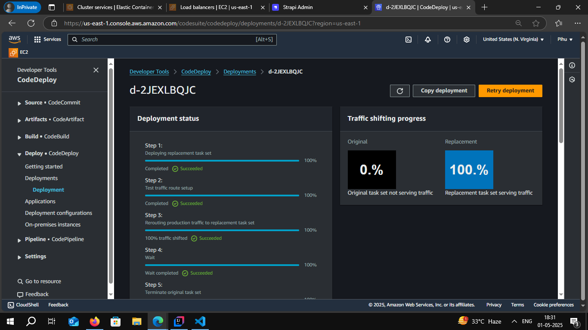

# TASK-10 --> 📘 Blue/Green Deployment Pipeline for Strapi on AWS ECS using GitHub Actions

# 🧩 Overview

This GitHub Actions workflow automates the **Blue/Green deployment** of a **Strapi backend** on **AWS ECS with Fargate**, using **Terraform** for infrastructure provisioning and **AWS CodeDeploy** for controlled, zero-downtime deployments.

---

## 🚀 Workflow Trigger

The workflow is triggered on:
- A `push` to the `main` branch (excluding specific files).
- Manually via `workflow_dispatch`.

---

## 🛠️ Workflow Structure

### 🔹 1. **Prepare Environment Job**

**Goal:** Build the Docker image and push it to Amazon ECR.

#### Steps:
- Checkout code.
- Configure AWS credentials.
- Login to Amazon ECR.
- Build Docker image from code.
- Push image to ECR with Git SHA tag.
- Save the full image URI for the next stages.

📦 **Output:** `image_uri` of the Docker image pushed to ECR.

---

### 🔹 2. **Deploy Infrastructure Job**

**Goal:** Provision or update ECS infrastructure using Terraform.

#### Steps:
- Checkout code.
- Configure AWS credentials.
- Setup Terraform.
- Initialize Terraform (`terraform init`).
- Create an execution plan (`terraform plan`).
- Apply the plan (`terraform apply`), using:
  - `TF_VAR_image_tag`: Docker image tag
  - `TF_VAR_ecr_repo_name`: ECR repository name

✅ **Only if successful**, the next job is triggered.

---

### 🔹 3. **Deploy New Version with Blue/Green**

**Goal:** Register a new ECS task definition and deploy it using AWS CodeDeploy with a Blue/Green strategy.

#### Steps:
- Checkout code.
- Configure AWS credentials.
- Construct the Docker image URI (if not passed).
- Retrieve current ECS task definition and replace image URI.
- Register new task definition with ECS.
- Generate `appspec.json` to instruct CodeDeploy.
- Upload `appspec.json` to S3.
- Create a new deployment in CodeDeploy:
  - Uses `CodeDeployDefault.ECSCanary10Percent5Minutes` strategy.
- Poll CodeDeploy deployment status:
  - Wait until success or failure.

## 🔄 Deployment Strategy

### ✅ CodeDeploy: ECS Blue/Green

- **Green:** New version of the ECS service (new task definition).
- **Blue:** Existing running version.
- Traffic is shifted **gradually** (10% → wait 5 min → 100%).
- Safe rollback is possible if deployment fails.

---

## ✅ Benefits

- Zero-downtime deployment.
- Rollback friendly.
- Fully automated with GitHub Actions.
- Reproducible infra with Terraform.
