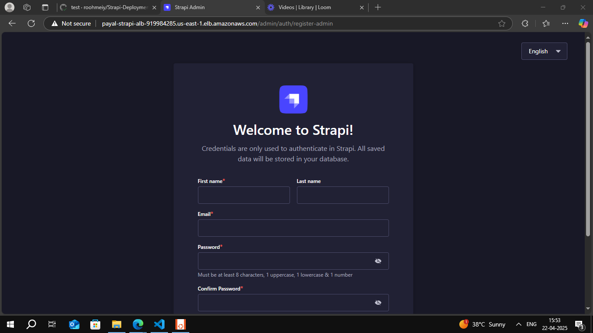
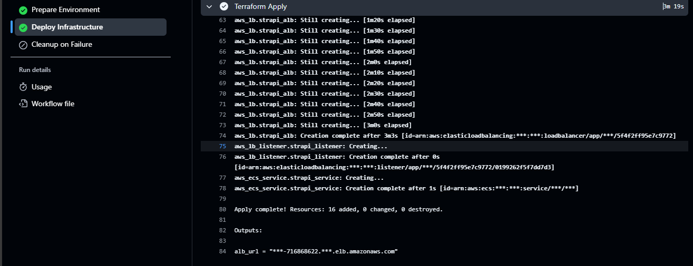
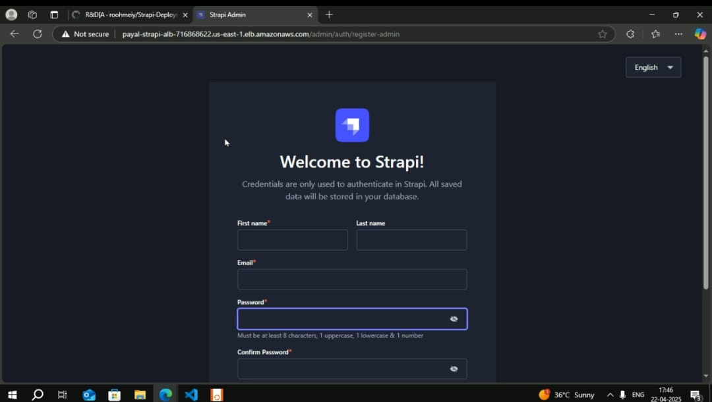
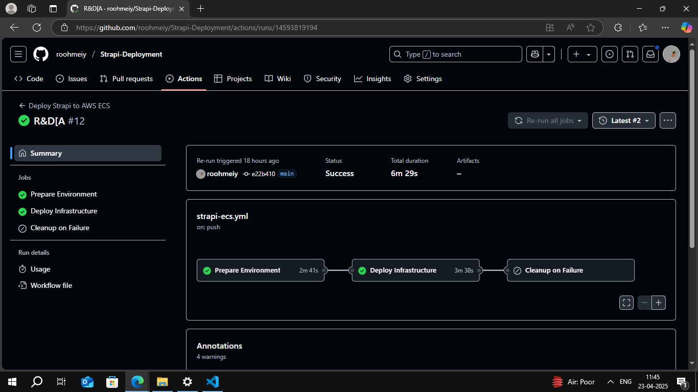

-  Deploys a Strapi CMS on AWS using Terraform and ECS Fargate.
Infrastructure includes VPC, subnets, security groups, ALB, and ECS services.
It pulls container images from an Amazon ECR repository.
CI/CD pipeline is automated using GitHub Actions for seamless deployment.






### The Terraform code is in directory- Terraform-ecs-cicd  and pipleine code is in .github/workflows/strapi-ecs-yaml

# Strapi AWS ECS Deployment Documentation

## Overview

This document describes the GitHub Actions workflow and Terraform configuration used to deploy a Strapi application to Amazon Elastic Container Service (ECS) fargate . The deployment pipeline builds a Docker image, pushes it to Amazon Elastic Container Registry (ECR), and deploys the containerized application to ECS using Fargate also theinfrastructure related to that such as vpc, subnet, internet gateway,route table, route table association, ALB, security groups, ECR repo.

## Deployment Pipeline

The GitHub Actions workflow automates the build and deployment process, using Terraform to manage the AWS infrastructure. The workflow is triggered by pushes to the main branch or can be manually triggered.

### Workflow Stages

1. **Prepare Environment**
   - Checks out the code repository
   - Configures AWS credentials
   - Builds and pushes the Docker image to ECR with commit SHA tag
   - Outputs the full image reference for use in subsequent jobs

2. **Deploy Infrastructure**
   - Sets up Terraform
   - Initializes Terraform working directory
   - Plans and applies the infrastructure changes
   - Forces a new deployment of the ECS service

3. **Cleanup on Failure**
   - Destroys all created resources if the deployment fails
   - Ensures no orphaned resources remain after a failed deployment

### Image Tagging Strategy

The workflow uses the Git commit SHA as the image tag to ensure immutable deployments and easy traceability:

```yaml
IMAGE_TAG: ${{ github.sha }}
```

The Docker image is built and pushed with this tag:

```yaml
docker build -t $ECR_REGISTRY/$ECR_REPOSITORY:$IMAGE_TAG .
docker push $ECR_REGISTRY/$ECR_REPOSITORY:$IMAGE_TAG
```

## AWS Infrastructure

The Terraform configuration creates and maintains the following AWS resources:

### Networking
- VPC with CIDR 10.0.0.0/16
- Two public subnets across different Availability Zones
- Internet Gateway
- Route Table with public internet route
- Security Group allowing traffic on ports 80 and 1337

### Container Services
- ECS Cluster
- Fargate-compatible Task Definition with environment variables
- ECS Service configured for high availability
- Application Load Balancer (ALB)
- Target Group with health checks

### Task Definition

The ECS Task Definition specifies a container using the ECR image built in the workflow:

```terraform
container_definitions = jsonencode([{
  name  = "strapi-app"
  image = "${data.aws_ecr_repository.strapi_repo.repository_url}:${var.image_tag}"
  # Additional configuration...
}])
```

The `image_tag` variable is populated with the Git commit SHA from the GitHub workflow.

## Configuration and Secrets

The deployment relies on the following GitHub secrets:

### AWS Configuration
- `AWS_ACCESS_KEY_ID`: AWS access key
- `AWS_SECRET_ACCESS_KEY`: AWS secret key
- `AWS_REGION`: Target AWS region

### ECR Configuration
- `ECR_REPOSITORY_NAME`: Name of the ECR repository

### Infrastructure Naming
- `VPC_NAME`: Name tag for the VPC
- `IGW_NAME`: Name tag for the Internet Gateway
- `SECURITY_GROUP_NAME`: Name tag for the Security Group
- `ECS_CLUSTER_NAME`: Name for the ECS cluster
- `TASK_DEFINITION_NAME`: Name for the ECS task definition
- `ECS_SERVICE_NAME`: Name for the ECS service
- `ALB_NAME`: Name for the Application Load Balancer
- `TARGET_GROUP_NAME`: Name for the ALB target group

### Strapi Configuration
- `API_TOKEN_SALT`: Salt for Strapi API tokens
- `ADMIN_JWT_SECRET`: Secret for Strapi admin JWT
- `TRANSFER_TOKEN_SALT`: Salt for transfer tokens
- `APP_KEYS`: Comma-separated app keys for Strapi

## Monitoring and Health Checks

The ALB is configured with health checks to monitor the Strapi application:

```terraform
health_check {
  path                = "/health"
  interval            = 30
  timeout             = 5
  healthy_threshold   = 2
  unhealthy_threshold = 2
  matcher             = "200-499"
}
```

## Scaling Considerations

The current configuration deploys a single instance of the Strapi application. To scale:
1. Increase the `desired_count` in the ECS service resource
2. Consider adjusting the container CPU and memory allocation
3. Monitor the ALB and adjust target group settings as needed


## Conclusion

This deployment configuration provides a reliable, immutable, and traceable way to deploy Strapi applications to AWS ECS fargate using GitHub Actions and Terraform. By using commit SHAs as image tags, each deployment is uniquely identifiable and can be traced back to a specific code version.