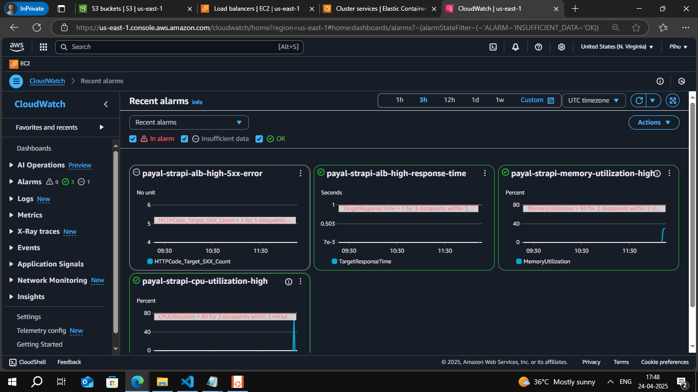
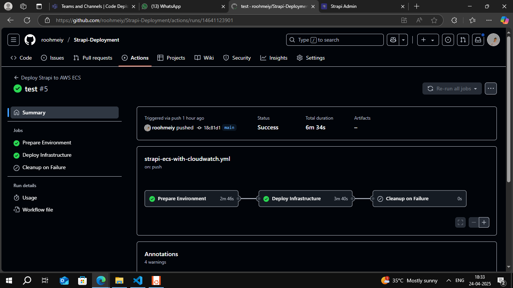
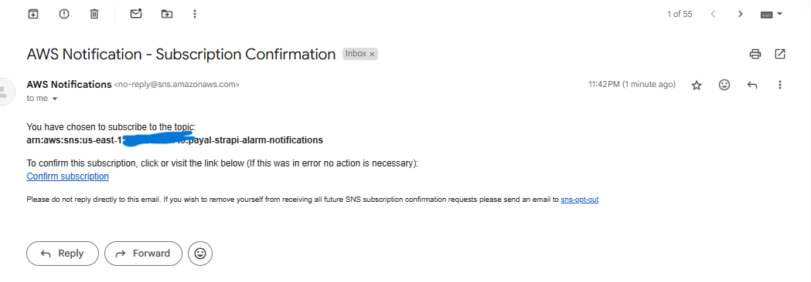

-  Deploys a Strapi CMS on AWS using Terraform and ECS Fargate.
Infrastructure includes VPC, subnets, security groups, ALB, and ECS services.
It pulls container images from an Amazon ECR repository.
CI/CD pipeline is automated using GitHub Actions for seamless deployment.
Also implemented monitoring --> metrics and alarm using cloudwatch metrics

### The Terraform code is in directory- Terraform-ecs-cloudwatch  and pipleine code is in .github/workflows/strapi-ecs-with-cloudwatch.yml

# 🚀 Strapi on AWS ECS (Fargate) with Terraform

This project automates the deployment of a Strapi application using **AWS ECS Fargate**, **CloudWatch**, and **Application Load Balancer**, all managed via **Terraform**.

---

## 📦 Features

- ECS Fargate deployment (no EC2)
- Public subnets across 2 AZs
- ALB for traffic routing
- Logs in CloudWatch
- CloudWatch Alarms:
  - High CPU (`>80%`)
  - High Memory (`>80%`)
  - High ALB response time (`>10s`)
  - 5XX error spike on ALB (`>5` in 1 min)
- Email notifications for alarms via SNS
- CloudWatch Dashboard with metrics and logs

---

## ⚙️ Components

- **ECS Cluster & Service**: Runs Strapi containers
- **Task Definition**: Defines container config with logging
- **ALB & Target Group**: Exposes Strapi (port `1337`) to the internet via HTTP (port `80`)
- **IAM Roles**: For ECS task execution and CloudWatch logging
- **CloudWatch Logs**: Logs sent from ECS containers
- **CloudWatch Alarms**: Notifies abnormal behavior
- **SNS Topic & Subscription**: Routes alarm notifications to email
- **Dashboard**: Visualize performance metrics and logs

## 📊 Monitoring

Accessible in CloudWatch:
- CPU & Memory usage of Strapi
- ALB request count & response time
- Recent logs from `/ecs/strapi`

## 🔔 Notifications

The deployment includes an SNS topic for CloudWatch alarm notifications:
- Configurable email destination through environment variables
- Notifications sent for both alarm and recovery events
- Supported alarms include CPU, memory, response time, and 5XX errors
- First-time deployment requires confirmation of the SNS subscription via email

