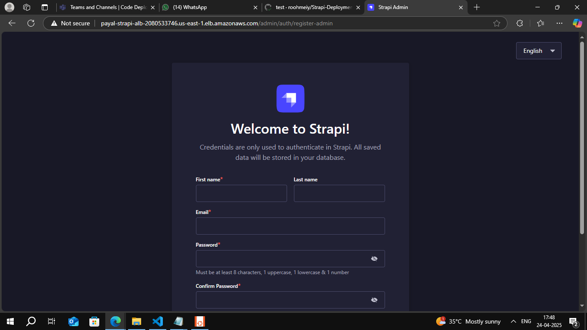

-  Deploys a Strapi CMS on AWS using Terraform and ECS Fargate.
Infrastructure includes VPC, subnets, security groups, ALB, and ECS services.
It pulls container images from an Amazon ECR repository.
CI/CD pipeline is automated using GitHub Actions for seamless deployment.
Also implemented monitoring --> metrics and alarm using cloudwatch metrics

### The Terraform code is in directory- Terraform-ecs-cloudwatch  and pipleine code is in .github/workflows/strapi-ecs-yaml

# 🚀 Strapi on AWS ECS (Fargate) with Terraform

This project automates the deployment of a Strapi application using **AWS ECS Fargate**, **CloudWatch**, and **Application Load Balancer**, all managed via **Terraform**.

---

## 📦 Features

- ECS Fargate deployment (no EC2)
- Public subnets across 2 AZs
- ALB for traffic routing
- Logs in CloudWatch
- CloudWatch Alarms:
  - High CPU (`>80%`)
  - High Memory (`>80%`)
  - High ALB response time (`>10s`)
  - 5XX error spike on ALB (`>5` in 1 min)
- CloudWatch Dashboard with metrics and logs

---

## ⚙️ Components

- **ECS Cluster & Service**: Runs Strapi containers
- **Task Definition**: Defines container config with logging
- **ALB & Target Group**: Exposes Strapi (port `1337`) to the internet via HTTP (port `80`)
- **IAM Roles**: For ECS task execution and CloudWatch logging
- **CloudWatch Logs**: Logs sent from ECS containers
- **CloudWatch Alarms**: Notifies abnormal behavior
- **Dashboard**: Visualize performance metrics and logs

## 📊 Monitoring

Accessible in CloudWatch:
- CPU & Memory usage of Strapi
- ALB request count & response time
- Recent logs from `/ecs/strapi`

This deployment configuration provides a reliable, immutable, and traceable way to deploy Strapi applications to AWS ECS fargate using GitHub Actions and Terraform. By using commit SHAs as image tags, each deployment is uniquely identifiable and can be traced back to a specific code version.